<div align="center">
  
# 🌾 Kosol Chou

<a href="https://git.io/typing-svg">
  
</a>

[](https://kosolchou.github.io/my-portfolio)
[](https://www.linkedin.com/in/kosol-chou-30430234b/)
[](mailto:kosolchou@gmail.com)
[](https://x.com/KosolChou)

</div>

---

## 👋 Hey there!

I'm **Kosol**, a Data Science student at the **Institute of Technology of Cambodia** with a mission: **bringing AI from satellites to rice fields**. 

Growing up in Cambodia, I've seen firsthand how technology can transform lives—especially in agriculture. That's why I'm dedicated to building practical AI solutions that help farmers, protect crops, and contribute to food security in Southeast Asia.

```python
class DataScientist:
    def __init__(self):
        self.name = "Kosol Chou"
        self.role = "Data Science Student & ML Engineer"
        self.location = "Phnom Penh, Cambodia 🇰🇭"
        self.education = "B.Sc. Data Science @ ITC (2022-Present)"
        
    def current_mission(self):
        return "Building AI solutions for agricultural challenges"
    
    def daily_stack(self):
        return {
            "languages": ["Python", "SQL", "R"],
            "ml_frameworks": ["TensorFlow", "scikit-learn", "XGBoost"],
            "data_tools": ["Pandas", "NumPy", "Matplotlib"],
            "special_skills": ["Remote Sensing", "GIS", "Time Series"]
        }
```

---

## 🚀 What I'm Working On

🌾 **CropXcel** - My flagship project combining satellite remote sensing + ML to help farmers prevent crop waterlogging  
📊 **Stock Prediction Models** - Deep learning with LSTM/GRU for financial forecasting  
🚗 **Traffic Forecasting** - ARIMA-based urban planning solutions  
📚 **Continuous Learning** - Currently mastering deep learning and advanced time series analysis

---

## 🌟 Featured Project: CropXcel

<div align="center">

### 🛰️ **Agricultural Intelligence Platform**

*Bridging the gap between space technology and sustainable farming*

[](https://waterlogging-monitoring.onrender.com)
[](https://github.com/KosolCHOU/Waterlogging-Monitoring)

</div>

**The Challenge:** Waterlogging destroys millions of hectares of crops globally, affecting food security and farmer livelihoods.

**My Solution:** A full-stack web platform that processes **Sentinel-1 SAR satellite data** in real-time to detect waterlogging risks and provide actionable insights.

### 🎯 Key Features

| Feature | Technology | Impact |
|---------|-----------|---------|
| 🛰️ **Real-time Satellite Analysis** | Sentinel-1 SAR, Python | Automated detection of waterlogging hotspots |
| 🗺️ **Interactive GIS Dashboard** | Leaflet.js, PostgreSQL | Field boundary drawing & multi-layer visualization |
| 🤖 **AI Recommendations** | Machine Learning, Django | Smart crop suggestions based on soil & terrain |
| ⚠️ **Smart Alert System** | Python, PostgreSQL | Automated risk assessment & farmer notifications |

### 💡 Technical Highlights
```python
# Example: SAR Data Processing Pipeline
def process_sentinel_data(sar_image):
    vv_band = extract_polarization(sar_image, 'VV')
    vh_band = extract_polarization(sar_image, 'VH')
    
    waterlogging_index = calculate_wri(vv_band, vh_band)
    hotspots = detect_anomalies(waterlogging_index, threshold=0.75)
    
    return generate_alerts(hotspots)
```

**Impact:** Helping Cambodian farmers prevent crop losses and optimize land use for food security 🌾

---

## 🛠️ Technical Arsenal

<div align="center">

### Languages & Frameworks


### Machine Learning & AI


### Web & Database


### Tools & Platforms


</div>

---

## 📊 GitHub Statistics

<div align="center">
  


</div>

---

## 🎓 Learning Journey

```mermaid
graph LR
    A[📚 B.Sc. Data Science] --> B[🛰️ Remote Sensing]
    B --> C[🤖 Machine Learning]
    C --> D[🌾 Agricultural AI]
    D --> E[💡 Real-World Impact]
    style A fill:#0ea5e9
    style E fill:#10b981
```



**Current Focus:**
- 🧠 Deep Learning with TensorFlow & Keras
- 📡 Advanced Remote Sensing & SAR Data Processing
- 📈 Time Series Forecasting & Statistical Modeling
- 🌐 Full-Stack Development for Data Applications

---

## 🌍 Let's Connect!

I'm always excited to collaborate on projects that combine **data science** with **social impact**, especially in:
- 🌾 **Agricultural Technology**
- 🛰️ **Remote Sensing & Geospatial Analysis**
- 📊 **Predictive Modeling & Forecasting**
- 🇰🇭 **Solutions for Southeast Asia**

<div align="center">

### 📬 Reach Out

[](https://kosolchou.github.io/my-portfolio)
[](mailto:kosolchou@gmail.com)
[](https://www.linkedin.com/in/kosol-chou-30430234b/)

</div>

---

<div align="center">

### 💭 Philosophy

*"From satellites 20,000km above to rice fields on the ground—technology should serve everyone."*

**🌾 Building AI for Cambodia's Future | 📊 One Dataset at a Time**


</div>

---

<div align="center">
  
</div>
